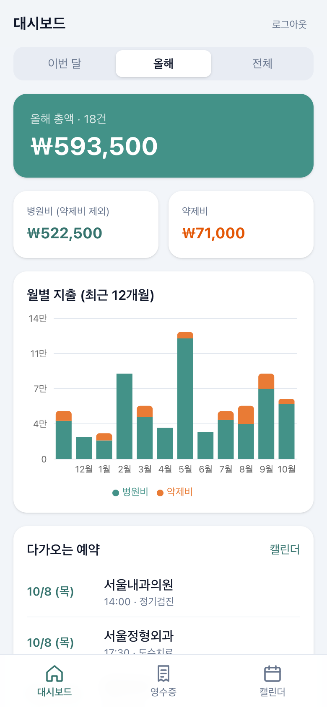
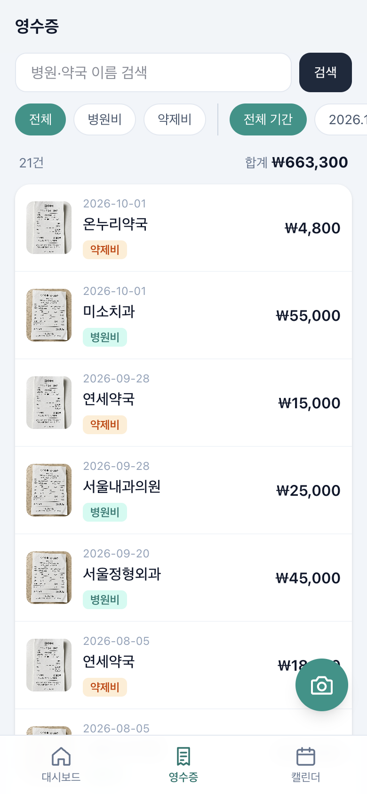
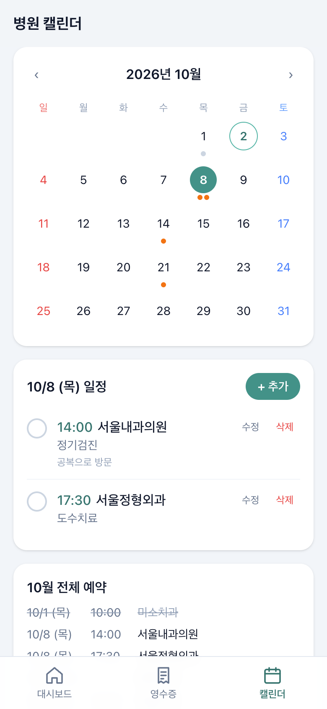
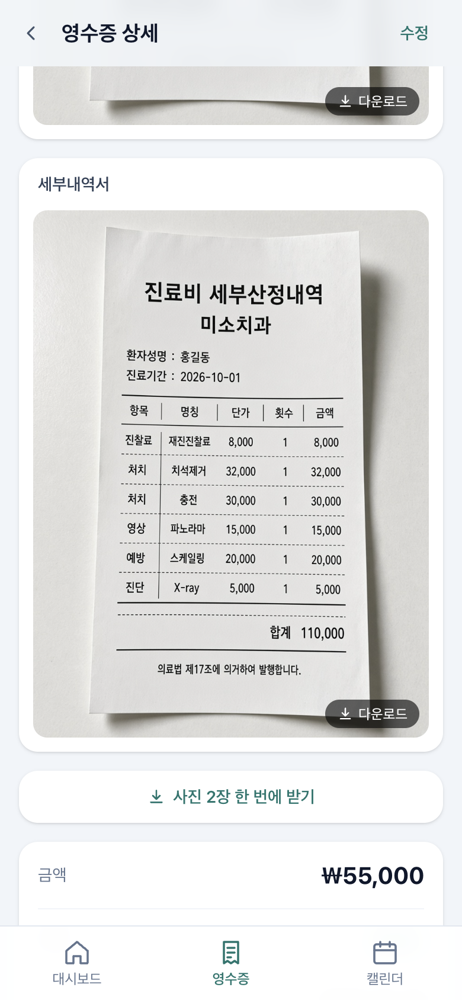
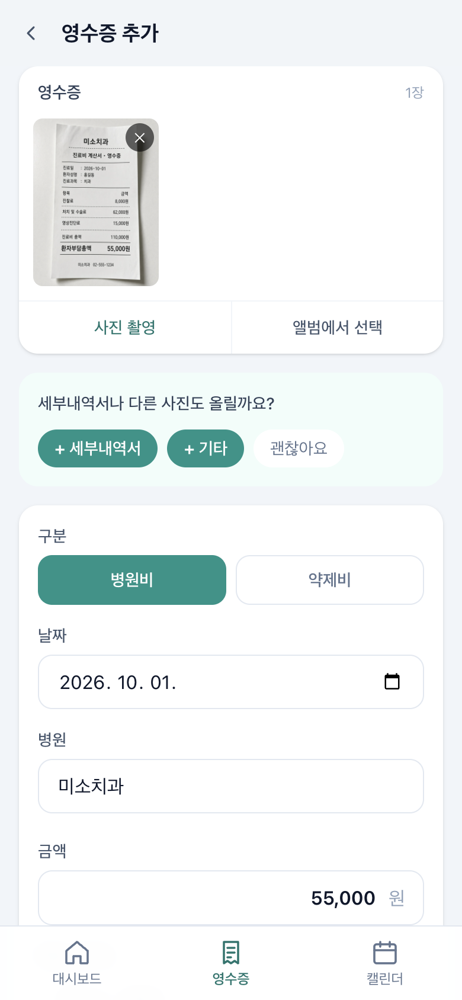
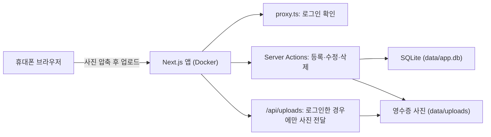

# 병원 영수증 관리

종이 병원 영수증을 휴대폰으로 찍어 올리고, 날짜·병원·구분(병원비/약제비)·금액을 기록하는 개인용 웹앱입니다.
지출 대시보드와 병원 예약 캘린더가 함께 있으며, 휴대폰으로 쓰는 것을 기준으로 만들었습니다.

`Next.js 16` `React 19` `TypeScript` `SQLite` `Drizzle ORM` `Tailwind CSS` `Recharts` `Docker`

## 스크린샷

<table>
  <tr>
    <td align="center"><br />대시보드</td>
    <td align="center"><br />영수증 목록</td>
    <td align="center"><br />병원 캘린더</td>
  </tr>
  <tr>
    <td align="center"><br />영수증 상세</td>
    <td align="center"><br />영수증 입력·수정</td>
    <td></td>
  </tr>
</table>

> 스크린샷의 병원·금액·영수증 사진은 모두 가상의 예시 데이터입니다.

## 만든 이유

병원과 약국을 다녀올 때마다 종이 영수증이 쌓이는데, 정작 "올해 병원비가 얼마였지?", "약값을 빼면 진료비는 얼마지?"를 알려면 영수증 뭉치를 다시 뒤져야 했습니다.
영수증을 받은 자리에서 휴대폰으로 바로 찍어 기록하고, 합계는 자동으로 보고, 다음 진료 일정까지 한곳에서 관리하고 싶어서 만들었습니다.

## 주요 기능

- **대시보드**: 이번 달 / 올해 / 전체 기간별 총액, 약제비를 뺀 병원비, 약제비 합계, 최근 12개월 월별 차트, 병원별 지출 순위, 다가오는 예약
- **영수증**: 카메라로 바로 촬영하거나 앨범에서 선택해 업로드(업로드 전 자동 압축), 날짜·병원·구분·금액·메모 입력과 수정, 구분·월·병원명으로 찾기. 병원·약국 이름은 구분별로 나눠 자주 간 곳부터 추천
- **병원 캘린더**: 월간 달력에 예약과 영수증을 함께 표시, 날짜별 예약 추가·수정·삭제, 진료 완료 체크. 같은 날 같은 병원의 영수증을 등록하면 예약이 자동으로 완료되고, 날짜가 지났는데 완료되지 않은 예약은 "놓친 예약"으로 흐리게 표시
- **로그인**: 1인용 비밀번호, 반복해서 틀리면 일정 시간 로그인 잠금

## 구조



- 화면과 API를 Next.js 하나로 처리합니다. 데이터 변경은 Server Actions로, 페이지는 서버 컴포넌트에서 DB를 직접 읽습니다.
- 모든 데이터는 `data/` 폴더 하나에 들어갑니다. 백업은 이 폴더만 복사하면 됩니다.

```
src/
  app/
    (main)/            # 로그인 후 화면 (하단 탭 공통 레이아웃)
      page.tsx         # 대시보드
      receipts/        # 영수증 목록·등록·상세·수정 + Server Actions
      calendar/        # 병원 캘린더 + Server Actions
    login/             # 로그인 화면
    api/uploads/       # 로그인 확인 후 영수증 사진 전달
  components/          # 영수증 폼, 예약 입력 시트, 차트, 하단 탭 등
  db/                  # Drizzle 스키마, SQLite 연결과 테이블 생성
  lib/                 # 인증, 로그인 시도 제한, 파일 저장, 조회 함수
  proxy.ts             # 로그인하지 않은 요청을 /login으로 보냄
```

## 기술적으로 고민한 부분

**별도 DB 서버 없이 SQLite 하나로**
혼자 쓰는 앱이라 DB 서버를 따로 두는 건 운영 부담만 늘립니다. SQLite 파일 하나와 사진 폴더만으로 동작하게 해서, 배포는 컨테이너 하나, 백업은 폴더 복사로 끝나게 했습니다. 서버가 처음 뜰 때 테이블이 없으면 자동으로 만듭니다.

**휴대폰에서 사진을 줄인 뒤 업로드**
요즘 휴대폰 사진은 한 장에 수 MB라 업로드가 느리고 서버 용량도 빨리 찹니다. 브라우저에서 약 1600px, 1MB 이하 JPEG로 줄인 뒤 보내도록 해서, 테스트에서는 2400×3200 이미지가 47KB가 됐습니다. 브라우저가 읽지 못하는 형식(예: Safari 밖의 HEIC)은 원본 그대로 올립니다.

**영수증 사진은 공개 폴더에 두지 않기**
영수증에는 이름과 진료 내역 같은 민감한 정보가 들어 있습니다. 사진을 `public/`에 두면 주소만 알면 누구나 볼 수 있으므로, 로그인 여부를 확인한 뒤에만 사진을 내려주는 라우트(`/api/uploads/[file]`)를 따로 만들고 파일 이름도 형식을 검사합니다.

**짧은 비밀번호를 위한 로그인 시도 제한**
휴대폰에서 매번 긴 비밀번호를 치기 번거로워 짧은 비밀번호를 쓰고 싶었고, 대신 무차별 대입을 막아야 했습니다. 15분 안에 10번 틀리면 15분, 하루 30번 틀리면 다음 날까지 로그인을 잠급니다.
처음에는 IP별로 막으려 했지만, Docker Desktop을 거치면 실제 접속 IP가 보이지 않고 `X-Forwarded-For` 헤더는 위조할 수 있어서 서버 전체 기준으로 세도록 바꿨습니다.

**캘린더에는 영수증을 복사하지 않고 읽어서 보여주기**
영수증을 캘린더에 띄울 때 예약 데이터로 따로 저장하지 않고, 캘린더 화면이 해당 달의 영수증을 직접 읽어 함께 표시합니다. 같은 내용이 두 곳에 저장되지 않으니 영수증을 고치거나 지워도 캘린더와 어긋날 일이 없습니다. 예약 완료 처리만 영수증 저장 시점에 같은 날짜·같은 병원 이름의 예약을 찾아 바꿉니다.

**로그인 확인을 한 곳에만 맡기지 않기**
`proxy.ts`에서 로그인하지 않은 요청을 걸러내지만, 각 페이지와 Server Action에서도 다시 세션을 확인합니다. Next.js 문서에서도 Proxy만으로 권한을 확인하지 말라고 권장합니다.

## 배포하며 겪은 문제

실제로 집의 Windows PC에 Docker Desktop으로 배포하고, 휴대폰으로 쓰면서 겪은 문제들입니다.

| 문제 | 원인 | 해결 |
| --- | --- | --- |
| SSH로 접속해 `docker compose build`를 하면 이미지를 받지 못함 | SSH 세션에서는 Docker Desktop이 Windows 자격 증명 저장소를 읽지 못함 | 로그인된 데스크톱 세션에서 실행되는 예약 작업으로 빌드 |
| 컨테이너 안에서 `npm ci` 실패 | `better-sqlite3`가 소스 빌드로 넘어갔는데 Python·컴파일러가 없음 | Dockerfile 의존성 단계에 `python3 make g++` 추가 |
| 80번 포트 충돌 | 같은 PC에서 Nginx Proxy Manager가 이미 80/443 사용 | 포트를 환경변수(`HOST_PORT`)로 바꿀 수 있게 하고 다른 포트로 배포 |
| 빌드 시 프로젝트 전체가 서버 번들에 포함된다는 경고 | `DATA_DIR` 환경변수로 만든 동적 경로를 번들러가 추적 | 해당 경로에 `turbopackIgnore` 주석 추가 |
| 아이폰에서 날짜 입력칸이 화면 밖으로 넘침 (Chrome 포함) | iOS 브라우저는 모두 WebKit을 쓰고, WebKit은 날짜·시간 입력에 자체 최소 너비를 둬서 `width: 100%`를 무시 | 날짜·시간 입력의 기본 모양(`appearance`)과 최소 너비를 해제하고 높이를 다른 입력칸과 맞춤 |

## 앞으로 할 일

- AI로 영수증 사진을 읽어 날짜·병원·금액을 미리 채우기
- 연말정산 의료비 공제용 CSV/엑셀 내보내기
- HTTPS 적용

## Windows 서버에 배포하기 (Docker Desktop)

1. [Docker Desktop](https://www.docker.com/products/docker-desktop/)을 설치하고 실행합니다.
2. 이 폴더를 서버에 복사한 뒤, `.env.example`을 복사해 `.env`를 만들고 값을 채웁니다.

   ```powershell
   copy .env.example .env
   notepad .env
   ```

   - `APP_PASSWORD`: 로그인 비밀번호
   - `SESSION_SECRET`: 16자 이상 임의 문자열
   - `HOST_PORT`: 접속 포트(기본 80). 80번을 다른 프로그램이 쓰고 있으면 예: `8080`

3. 빌드하고 실행합니다. SSH 창이 아닌 데스크톱의 PowerShell에서 실행하세요(위 "배포하며 겪은 문제" 참고).

   ```powershell
   docker compose up -d --build
   ```

4. Windows 방화벽에서 해당 포트의 인바운드를 허용합니다(관리자 PowerShell).

   ```powershell
   New-NetFirewallRule -DisplayName "receipt" -Direction Inbound -Protocol TCP -LocalPort 80 -Action Allow
   ```

5. 휴대폰에서 `http://서버IP` (포트를 바꿨다면 `http://서버IP:8080`)로 접속합니다.
   - 같은 와이파이: `ipconfig`의 IPv4 주소 사용
   - 외부망: 공유기에서 포트포워딩 설정 후 공인 IP로 접속

### 업데이트 / 중지 / 로그

```powershell
docker compose up -d --build   # 코드 수정 후 다시 배포
docker compose down            # 중지
docker compose logs -f         # 로그 보기
```

### 백업

`data` 폴더(DB + 사진)만 복사해 두면 됩니다. 복원은 `data` 폴더를 되돌려 놓고 다시 실행하면 됩니다.

## 참고

- 휴대폰 홈 화면에 추가하면 앱처럼 쓸 수 있습니다(Safari/Chrome의 "홈 화면에 추가").
- 현재는 HTTP라서 비밀번호가 암호화되지 않은 채 전송됩니다. 외부망에 공개한다면 HTTPS 리버스 프록시(Caddy 등)를 앞에 두고 `.env`의 `COOKIE_SECURE=true`로 바꾸는 것을 권장합니다.

## 로컬 개발

Node.js 22.13 이상(권장 24)이 필요합니다.

```bash
npm install
cp .env.example .env.local   # 값 채우기
npm run dev
```
